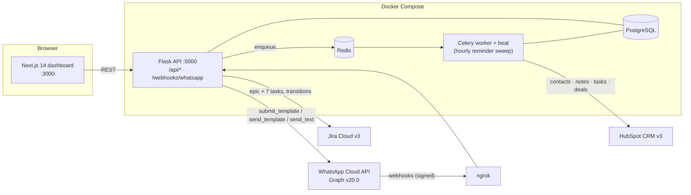
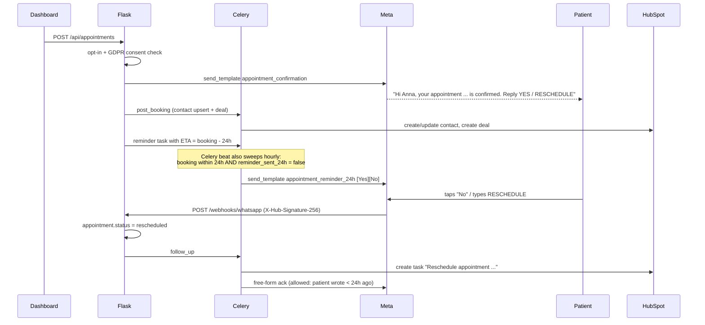

# BPO Client Onboarding Hub — WhatsApp Business API

A multi-tenant onboarding platform for an agency/BSP that puts end-clients on the WhatsApp Business API. It mirrors the real 360dialog / Meta BSP flow — intake → Business Manager verification → number provisioning → webhook setup → template approval → opt-in test → go-live — and is demoed with one healthcare client, **Berlin Dental Clinic** (appointment confirmation + 24h reminder).

The emphasis is on **onboarding, template management, GDPR and CRM integration**, not on chat UI.

**▶ Live demo (no install): https://rafaym1.github.io/BPO-Client-Onboarding-Hub-for-WhatsApp-Business-API/**

> **Mock-first.** With no credentials in `.env`, WhatsApp, HubSpot and Jira all run against a local mock that behaves like the real thing (including Meta-shaped webhooks fed through the *real* webhook handler). Add a credential and that integration flips to live automatically. See [Mock vs live](#mock-vs-live).

| Stack | |
|---|---|
| Backend | Python 3.11, Flask, Flask-SQLAlchemy, Alembic, Pydantic v2 |
| Data / queue | PostgreSQL 16, Redis 7, Celery (worker + beat) |
| Frontend | Next.js 14 (App Router), Tailwind CSS, shadcn/ui-style components |
| Integrations | WhatsApp Cloud API Graph v20.0, HubSpot CRM v3, Jira Cloud v3 |
| Infra | Docker Compose, ngrok (optional profile) |

---

## Quick start (mock mode, no accounts needed)

```bash
cp .env.example .env
docker compose up --build
```

| URL | What |
|---|---|
| http://localhost:3000 | Dashboard |
| http://localhost:5000/api/health | API |
| http://localhost:5000/api/dev/mock-log/jira · `/hubspot` · `/whatsapp` | What the mocks "sent" (JSON) |

Optionally seed the demo client (or set `SEED_DEMO=true` in `.env`):

```bash
docker compose exec web python -m app.seed                      # Berlin Dental Clinic, 3 draft templates, 2 contacts
docker compose exec web python -m app.seed --approve-templates  # ...templates already approved, ready to book
docker compose exec web python -m app.seed --advance 4 --reset  # ...first 4 onboarding steps already done
```

Compose services: `web` (Flask + Alembic migrations on start), `worker` (Celery worker with embedded beat), `db`, `redis`, `frontend` (Next dev server, hot reload), and an optional `ngrok`.

### Running without Docker

```bash
cd backend
python -m venv .venv && source .venv/bin/activate      # Windows: .venv\Scripts\activate
pip install -r requirements.txt
export DATABASE_URL=sqlite:///dev.db CELERY_EAGER=true # no Postgres/Redis needed: tasks run inline
alembic upgrade head && python -m app.seed
flask --app wsgi run -p 5000

cd ../frontend && npm install && npm run dev
```

`CELERY_EAGER=true` runs queued tasks inline (ETA-scheduled ones are skipped; the hourly sweep covers them). Mock delivery receipts and template reviews then complete instantly instead of after a few seconds.

### Tests

```bash
cd backend && pytest -q
```

26 end-to-end tests cover: client creation → checklist + Jira epic, step advancement, template submission/approval/rejection webhooks, webhook verification and HMAC signature checks, dedupe on retries, GDPR opt-in gating, the 24h window, booking → confirmation, the hourly reminder sweep (no double send), NO/RESCHEDULE handling, and STOP.

---

## Interactive demo on GitHub Pages

GitHub Pages only hosts static files, so it cannot run Flask, Postgres or Celery. The published demo is therefore the **same Next.js dashboard** built with `NEXT_PUBLIC_DEMO_MODE=true`, where `lib/api.ts` swaps the HTTP client for `lib/demo-backend.ts`: an in-browser port of the backend's business rules (checklist → client status, template review, GDPR opt-in gate, 24h window, reminders, NO / RESCHEDULE / STOP, Jira and HubSpot side effects), persisted in `localStorage`.

- Nothing leaves the browser: no real Meta, Jira or HubSpot calls, no server, no data collected. **Reset demo** (top banner) restores the seed data.
- The **Integration log** button shows every simulated Jira / HubSpot / WhatsApp call, so the CRM side is visible.
- The demo is a faithful *simulation* of the flows, not the backend itself. The Flask API, Celery worker, Alembic schema and webhook signature checks are what run in the Docker setup above.
- It is limited to 30 clients (routes are pre-rendered as `/clients/c1…c30`; the banner's Reset clears them).
- Deployed by `.github/workflows/pages.yml` on every push to `main`. To build it locally:

```bash
cd frontend && npm ci
NEXT_PUBLIC_BASE_PATH=/BPO-Client-Onboarding-Hub-for-WhatsApp-Business-API npm run build:demo   # output in frontend/out
```

---

## Architecture



### Appointment flow (the healthcare demo logic)



### Code map

```
backend/app/
  models.py              6 tables (+ 3 small additive columns, see below)
  schemas.py             Pydantic request models
  routes/                clients · templates · appointments · contacts (inbox) · webhooks · dev
  services/
    whatsapp_service.py    send_template · send_text · submit_template   (real Graph calls or mock)
    jira_service.py        create_onboarding_epic · update_issue_status  (real or mock)
    hubspot_service.py     create_or_update_contact · log_engagement · create_deal_for_appointment · create_task
    onboarding_service.py  advance_checklist_step, client status derivation, Jira sync
    messaging_service.py   the ONLY sender: opt-in + 24h-window enforcement, message persistence
    appointment_service.py booking, 24h reminder (atomic claim => never double-sent)
    webhook_service.py     messages / statuses / message_template_status_update
    template_service.py    submit to Meta, healthcare starter pack
  tasks.py               Celery tasks (HubSpot logging, reminders, inbound follow-up, mock Meta)
  seed.py                demo data
backend/migrations/      Alembic (initial schema)
frontend/app/dashboard/  clients · clients/[id]/{onboarding,templates,inbox,appointments}
frontend/lib/            api client, types, demo-backend.ts (in-browser mock API for the Pages demo)
```

---

## Mock vs live

Each integration decides independently. `MOCK_<SERVICE>=auto` (default) mocks when its credentials are blank; force with `true`/`false`. The dashboard header shows which are mocked.

| Integration | Live when set | Mock behaviour |
|---|---|---|
| WhatsApp | `WHATSAPP_TOKEN` | Fake `wamid`s. Delivery receipts (sent → delivered → read) and template review results are generated as Meta-shaped webhook payloads and processed by the real handler. Utility templates that read like promotions (“20% off”) get rejected with `INCORRECT_CATEGORY` so you can demo rejection. |
| HubSpot | `HUBSPOT_TOKEN` | Stable fake ids; every upsert/note/task/deal is written to the mock log. |
| Jira | `JIRA_EMAIL` + `JIRA_API_TOKEN` + `JIRA_DOMAIN` | `BPO-1xx` keys, issue transitions logged. Links point at `mock.atlassian.net`. |

Mock actions are appended to `MOCK_DATA_DIR/*.jsonl` (a shared volume, so web and worker agree) and are readable at `/api/dev/mock-log/{whatsapp,hubspot,jira}`.

Demo helpers (`DEV_TOOLS=true`): *Simulate patient reply* buttons in the Inbox, *Approve/Reject* on pending templates, and *Run reminder sweep now* on Appointments. They post Meta-shaped payloads to the same processor the real webhook uses. Set `DEV_TOOLS=false` for anything public.

---

## Setup: Meta test number + ngrok (real WhatsApp webhooks)

You do not need a verified business to try this: Meta gives every developer app a **test number**.

1. **Create the app.** [developers.facebook.com](https://developers.facebook.com) → *Create app* → type **Business** → add the **WhatsApp** product.
2. **Grab the IDs.** WhatsApp → *API Setup*. Copy:
   - **Phone number ID** → `PHONE_NUMBER_ID`
   - **WhatsApp Business Account ID** → `WABA_ID`
   - **Temporary access token** (24h; for anything longer create a *System User* token with `whatsapp_business_messaging` + `whatsapp_business_management`) → `WHATSAPP_TOKEN`
3. **App secret.** App settings → *Basic* → *App secret* → `WHATSAPP_APP_SECRET`. This validates the `X-Hub-Signature-256` header on every webhook POST.
4. **Add your phone as a recipient.** API Setup → *To* → add your own WhatsApp number and confirm the code. The test number can only message up to 5 pre-registered recipients.
5. **Pick a verify token.** Any string, e.g. `VERIFY_TOKEN=bpo-verify-token` (must match step 7).
6. **Expose the API with ngrok.**
   ```bash
   # add NGROK_AUTHTOKEN to .env (dashboard.ngrok.com), then:
   docker compose --profile ngrok up --build
   # the https URL is shown at http://localhost:4040
   ```
   Or on the host: `ngrok http 5000`.
7. **Register the webhook.** WhatsApp → *Configuration* → *Webhook* → *Edit*:
   - Callback URL: `https://<your-subdomain>.ngrok-free.app/webhooks/whatsapp`
   - Verify token: your `VERIFY_TOKEN`
   - Click *Verify and save* — Meta calls `GET /webhooks/whatsapp?hub.mode=subscribe&hub.verify_token=…&hub.challenge=…` and the API echoes the challenge.
8. **Subscribe to fields.** Under *Webhook fields* subscribe to **`messages`** (inbound messages + delivery statuses) and **`message_template_status_update`** (approval/rejection).
9. **Restart** so the containers pick up `.env`: `docker compose up -d --force-recreate web worker`. The header chip should now read *WhatsApp: live*.

**Notes**
- All clients created with blank WABA/Phone ID default to this one test number. Inbound webhooks are routed by `phone_number_id`; when several clients share it, the **newest client wins**. Real tenants have their own number, so routing is unambiguous.
- The test number can only message the recipients you registered in step 4; sending to anyone else fails at Meta with a "recipient not in allowed list" error, which the API surfaces as a `502 whatsapp_error`.
- ngrok free URLs change on restart; re-paste the callback URL each time.
- HubSpot (optional): create a *Private app* with contacts, deals, notes and tasks read/write scopes → `HUBSPOT_TOKEN`.
- Jira (optional): create an API token at id.atlassian.com; the project (`JIRA_PROJECT_KEY`) needs an **Epic** type and a child type matching `JIRA_TASK_ISSUE_TYPE` (default *Task*).

---

## EMEA compliance notes

*Engineering notes for the demo, not legal advice.*

**GDPR — consent and lawful basis**
- **Opt-in is enforced in code, not in policy.** `messaging_service` refuses to send *any* template unless `contacts.opt_in_status = opted_in` **and** `gdpr_consent = true` (HTTP 403 `not_opted_in` / `no_gdpr_consent`). Free-form text is refused for opted-out contacts.
- **Provable consent (Art. 7(1)).** Recording an opt-in requires a source (`qr` / `keyword` / `api`) and stores `opt_in_timestamp` plus the exact `gdpr_consent_text` shown to the patient. Both the API and the UI show opt-in state everywhere a contact appears.
- **Withdrawal is as easy as giving consent (Art. 7(3)).** Replying `STOP` / `STOPP` / `ABMELDEN` opts the contact out immediately (before any follow-up runs), sets `gdpr_consent = false`, sends one unsubscribe confirmation and blocks all further sends. The original source/timestamp are kept as an audit trail.
- A booking made by phone without WhatsApp consent is still saved; only the message is withheld and the UI says so.

**WhatsApp policy**
- **24h customer-service window.** Free-form text is only allowed if the contact's last *inbound* message is < 24h old (`service_window` is computed per contact and shown in the inbox). Otherwise the composer forces an approved template (HTTP 403 `window_closed`).
- **Templates need Meta approval** and a correct category. The starter pack is *utility*; the UI surfaces Meta's rejection reason with a hint (e.g. `INCORRECT_CATEGORY`).
- **Webhook integrity.** Every POST is verified with HMAC-SHA256 (`X-Hub-Signature-256`, constant-time compare) over the raw body; inbound messages are de-duplicated on `wamid` because Meta retries.

**Healthcare-specific**
- Appointment data at a dental clinic can be health data (GDPR Art. 9). Templates deliberately carry only name, clinic and time: no treatment, diagnosis or insurer details. Keep it that way when adding templates.
- Message bodies are stored in `messages.content_json`. A production deployment needs a **retention period**, deletion on erasure requests (Art. 17), and a **DPA** with the BSP/hosting provider. Cascade deletes are already wired from `clients` → contacts → messages.
- Data residency: decide where Postgres/Redis are hosted (EU region) and document Meta/BSP processing in the client's record of processing.

**Also worth raising with any EMEA client**: Business Manager verification (needed to lift messaging limits and get the official business account), display-name approval, quality rating and messaging-limit tiers, and Meta's per-message pricing by template category (check current rate cards).

---

## How to demo

Full narrated version: **[LOOM_SCRIPT.md](LOOM_SCRIPT.md)**. The short form:

1. **Fresh DB**, `docker compose up`. Open http://localhost:3000.
2. **Onboard New Client** → "Berlin Dental Clinic", DE. You land on the onboarding board; note the Jira epic **BPO-1xx** and 7 sub-tasks with clickable keys.
3. **Templates** → *Load healthcare starter pack* → *Submit all 3 to Meta*. Statuses go yellow → green as the approval webhooks land; **Onboarding** → *Template Pack Submission* completes itself.
4. **Appointments** → *Book Test Appointment*: new patient (your WhatsApp number when live), consent ticked. Confirmation template goes out; the deal appears in the HubSpot mock log.
5. **Inbox**: the message with ticks going ✓ → ✓✓ → blue ✓✓. Reply **RESCHEDULE** (real phone, or the demo buttons in mock mode): appointment flips to *rescheduled*, a HubSpot task is created, an acknowledgement goes back.
6. **Appointments** → *Run reminder sweep now* to show the 24h reminder with Yes/No buttons.
7. Show the compliance guards: text a contact with a closed window (blocked → template), or a contact without opt-in (blocked).

---

## API overview

| Method & path | Purpose |
|---|---|
| `GET/POST /api/clients` · `GET/PATCH/DELETE /api/clients/:id` | CRUD. `POST` also creates the 7-step checklist and the Jira epic + 7 sub-tasks |
| `GET /api/clients/:id/checklist` · `PATCH …/checklist/:step_id` | Step status (`done` calls `advance_checklist_step`, syncs Jira, advances client status) |
| `POST /api/clients/:id/jira` | Retry Jira provisioning |
| `POST /api/clients/:id/starter-pack` | Create the 3 healthcare templates as drafts |
| `GET/POST /api/templates?client_id=` · `PATCH/DELETE /:id` | CRUD. `POST` submits to `POST /{waba_id}/message_templates` unless `submit=false` |
| `POST /api/templates/:id/submit` | Submit a draft / resubmit a rejected template |
| `GET/POST /api/appointments?client_id=` · `PATCH /:id` | Booking → confirmation template + 24h reminder scheduling |
| `GET/POST /api/contacts?client_id=` · `POST /api/contacts/:id/opt-in` | Contacts and GDPR opt-in/out |
| `GET /api/clients/:id/inbox` · `GET/POST /api/contacts/:id/messages` | Inbox, thread, send text/template (compliance-checked) |
| `GET/POST /webhooks/whatsapp` | Meta verification handshake and signed event intake |
| `GET /api/config` | Which integrations are mocked |
| `POST /api/dev/simulate/inbound` · `…/simulate/template-status` · `…/run-reminders` · `GET …/mock-log/:service` | Demo helpers (`DEV_TOOLS`) |

Errors are `{"error": {"code", "message", "details?"}}`: `422` validation, `403` compliance, `409` conflict, `502` upstream WhatsApp error.

---

## Design notes and deviations from the brief

- **Three additive columns** beyond the specified schema: `clients.jira_epic_key` (link the epic), `clients.go_live_date` (the clients table shows it), and `wa_templates.extras_json` (footer text, header text, quick-reply buttons). Nothing specified was changed or dropped.
- **Enums are VARCHAR + CHECK**, not native Postgres enums, so adding a status later is a plain migration.
- **Client status is derived from the checklist**: the earliest unfinished step decides `onboarding_status`; all seven done ⇒ `live` + `go_live_date`. Go-live can't be completed while earlier steps are open. *Template Pack Submission* auto-completes when all templates (≥ 3) are approved.
- **Beat runs inside the worker** (`celery worker -B`) to keep the compose file to the five requested services. Split it into its own service before running more than one worker.
- **Reminder scheduling is belt and braces**: an ETA task at `booking − 24h` *and* the hourly beat sweep, made idempotent with an atomic `UPDATE … WHERE reminder_sent_24h = false`. A booking made < 24h ahead gets its reminder on the next sweep.
- **A Jira outage doesn't block client creation**; the API returns `jira_error` and `POST /api/clients/:id/jira` retries.
- **No auth on the API or dashboard.** Fine for a local demo; add authentication before exposing it.
- Not built: template deletion on Meta's side (delete is local only), media/header images, HubSpot two-way sync, multi-user roles.
- Only the mock paths were exercised end to end during development. The real Graph / HubSpot / Jira request shapes follow the vendors' docs but have not been run against live accounts, so expect small fixes on first contact (e.g. your Jira project's issue types or workflow transition names).
